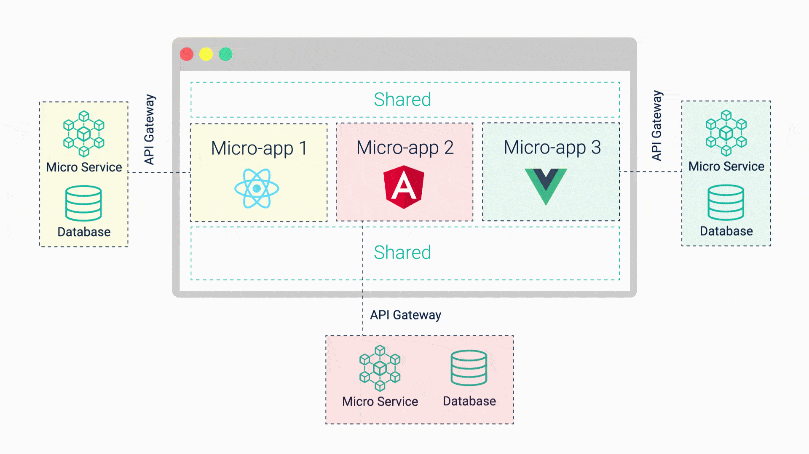
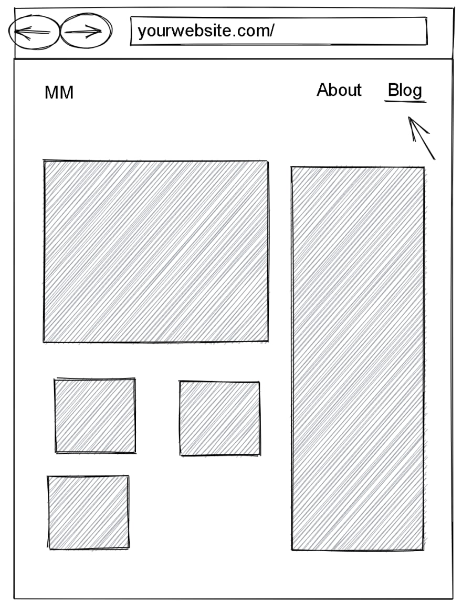
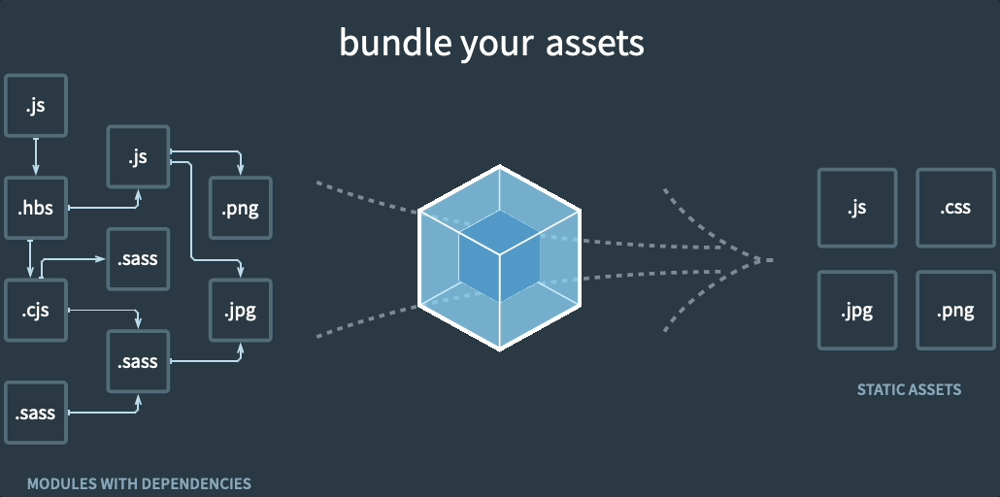

<!-- _class: lead gaia -->

# Création d'un Microfrontend avec Module Federation

---

# Microfrontend ?

➡️ Microservices

Définition :

> An architectural style where independently deliverable frontend applications are composed into a greater whole.

<cite>Martin Fowler</cite>

---

---

<!-- _class: lead gaia -->

---

<!-- _class: lead -->

# Comment faire ?

- Avec Module Federation
- Avec des Web Components
- Avec des IFrames

---

<!-- _class: lead invert -->

# Webpack

---

# Module Federation

- Plugin Webpack (Webpack 5)
- Chargement asynchrone de modules distants (pas dans le code de l'application).
  - Le code est chargé dynamiquement à l'exécution avec les dépendances si nécessaires.

---

# Ressources

- [Micro Frontends](https://martinfowler.com/articles/micro-frontends.html) par Martin Fowler
- [The History of Microfrontends](https://levelup.gitconnected.com/the-history-of-microfrontends-a8e9e5e9a1d4)
